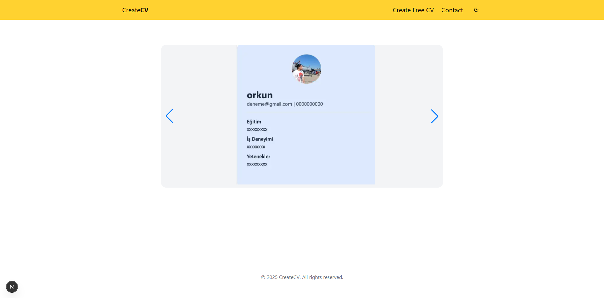
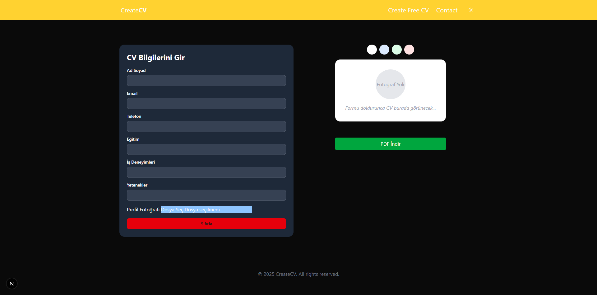
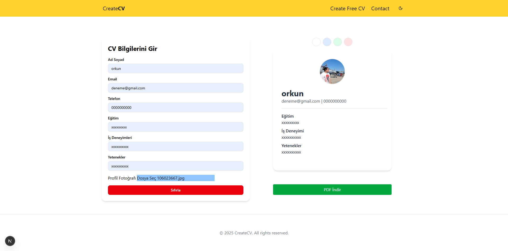
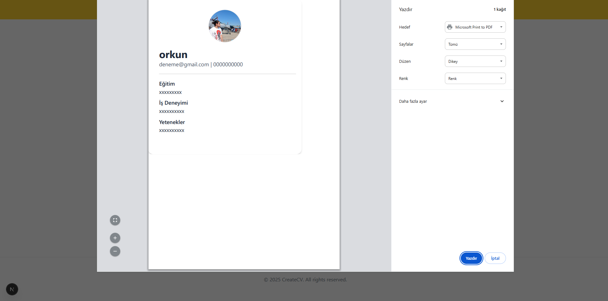

## Getting Started

First, run the development server:

```bash
npm run dev
# or
yarn dev
# or
pnpm dev
# or
bun dev
```

## Görseller

### CV



### CV



### CV



### CV



### LİVE DEMO

https://cv-slider-project.vercel.app
